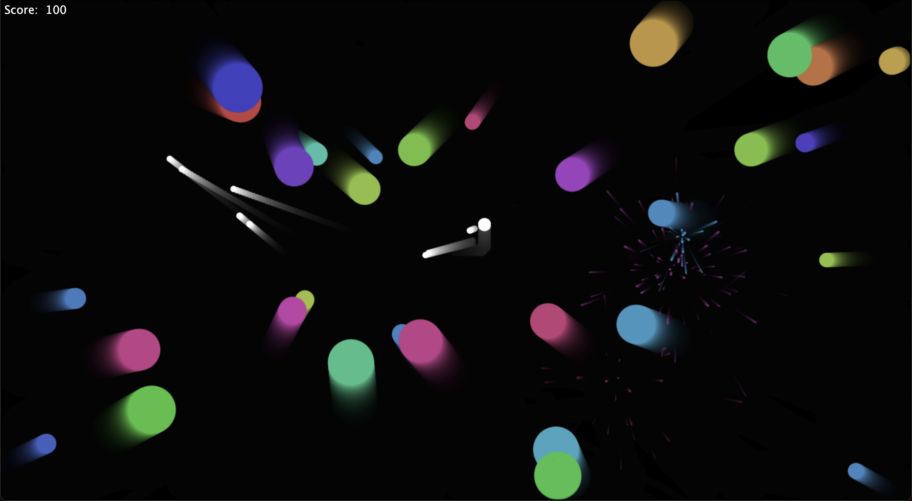

# DodgeBalls

Play the game at: https://daneelsan.github.io/DodgeBalls/

The objective of the game is to shoot as many balls as possible before they touch you.

The engine of the game is written in pure Javascript, using full advange of HTML canvas.

I followed this excellent tutorial https://www.youtube.com/watch?v=eI9idPTT0c4.

The tutorial has lots of things that make it pretty complete:
  * Object collision (bounce, destruction, etc.)
  * Particle generation
  * Score counting
  * Game Over button
  * Stylish animations
  * etc.

Added some new features, e.g. the player can now move.

As opposed to Chris, I didn't use any external libraries, neither for animation nor CSS styling.

Hopefully in the future I take the full course he offers https://chriscourses.com/game-course.

